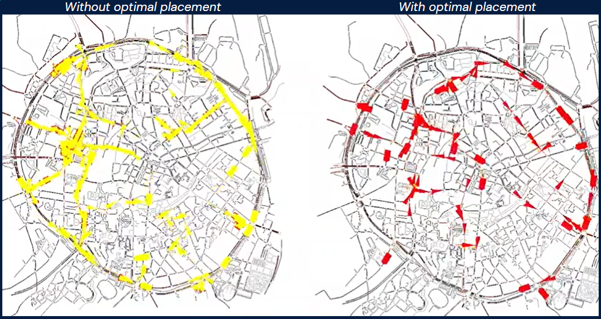

# Codagon Challenge by MobiDataLab
The city of Leuven is actively pursuing a modal shift away from private cars, prioritizing the use of public transport, bicycles, and new mobility options. However, the current modal share of shared mobility services and public transport remains relatively low compared to walking or private vehicles. Notably, a significant number of people still rely on personal motor vehicles to commute from peri-urban areas to the city center.

## Challenge Focus: Optimal Hub Placement Algorithm
For our **Codagon Challenge** submission, our primary focus was on developing an algorithm to identify the optimal placement of multimodal mobility hubs. This algorithm assigns a score to each candidate position based on key factors such as population density, transportation accessibility, parking facilities, and travel patterns. The resulting tool dynamically positions each hub, maximizing the overall score through a weighting system. Importantly, our solution empowers city administrators by providing insights into the most strategic locations without requiring coding skills.

## Initial Exploration and Visualization

The initial steps of the challenge involved a meticulous exploration of the dataset, delving into various aspects of Leuven's transportation landscape. Through extensive data analysis, we gained valuable insights into traffic patterns, population density, transportation accessibility, and parking facilities. 
In particular, we conducted numerous visualizations, which played a pivotal role in shaping our understanding of the existing transportation dynamics. Here an example of viz for car traffic flows during peak hours (8AM):

## Key Features of Our Solution
- Dynamic Positioning: The tool dynamically places each hub to maximize the overall score, ensuring optimal placement in real-time. It's important to highligh that scores are automatically adjusted whenever a new hub is placed, in order to avoid placing all the hubs in the same areas. 
- Weighting System: The algorithm employs a weighting system based on a bunch of influential factors we identified. Such factors are the ones we retained to be the most significant, but they can be easily changed according to the user's priorities. 

### Visualizing Optimal Hub Locations
Below you can observe the optimal locations of the hubs. These hubs are categorized into small and large hubs, complemented by existing off-street parking areas that can function as 'easy-to-make' hubs. The map provides a detailed focus on the city center, showcasing the strategic distribution of mobility hubs.

### Simulation Validation using SUMO
To validate the effectiveness of our solution, we conducted a simulation using the specialized software [SUMO](https://www.eclipse.org/sumo/) (Simulating Urban MObility). The simulation involved comparing scenarios without optimal hubs to scenarios with optimal placements. We assumed a 10% reduction in private cars entering the city center, demonstrating the tangible impact of our solution.

